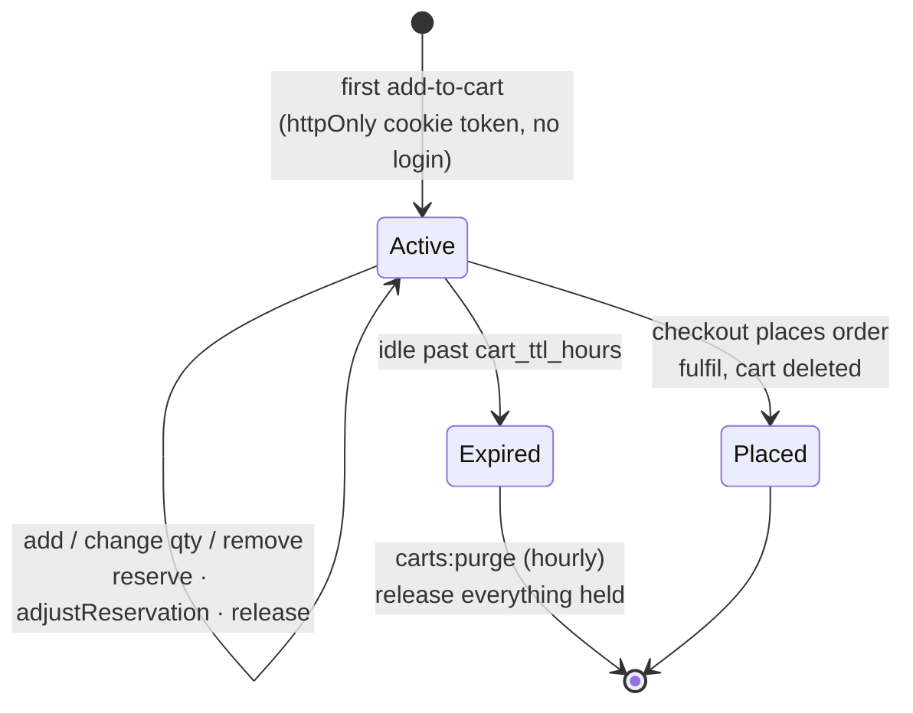
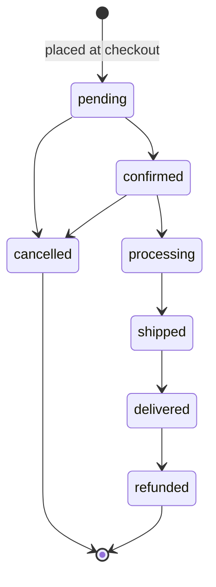

# Architecture

A short map of how the shop fits together. For *why* any of this is the way it is, see
[`DECISIONS.md`](DECISIONS.md); each section below names the entries that explain it.

## Layers

```
routes/web.php ──► Controller (thin) ──► FormRequest (all validation)
                        │
                        ▼
                   App\Services  ◄── the only place business rules live
       CartService · StockService · CheckoutService · ShippingCalculator
       OrderStatusService · PaymentGateways · OrderNumber
                        │
                        ▼
      Models + backed enums (OrderStatus, PaymentStatus, PaymentMethod,
      StockMovementReason — each carries label()/color() for Filament)
                        │
                        ▼
      Events: OrderPlaced · OrderStatusChanged · StockLow
                        │
                        ▼
      Listeners ──► queued Mailables (database queue; never block a request)
```

The Filament dashboard (`app/Filament`) sits beside the controllers and calls **the same
services**. It never writes stock or order status itself (D-26, D-27).

## Stock

`products.stock_qty` is the number **available to sell**. It has exactly one writer,
`StockService`, and every change is also a row in `product_stock_movements`. So at any moment
**the sum of a product's movements equals its `stock_qty`**, and every unit can be explained.

Every write re-reads the product row under `SELECT … FOR UPDATE` inside a transaction, re-checks
availability, and refuses rather than going below zero. Tests assert the observable behaviour
(never negative, the true maximum reported back, movements balance), because SQLite ignores the
lock itself. Run the suite on MySQL before launch (D-03, D-28).

| Operation | Called by | Ledger | `stock_qty` |
|---|---|---|---|
| `reserve` | add to cart, raise quantity | `order_reserved` −n | −n |
| `release` | lower quantity, remove, cart expiry, order cancelled | `order_released` +n | +n |
| `fulfil` | order placed | `order_released` +n **and** `order_fulfilled` −n | unchanged (already held) |
| `adjust` | admin *Adjust stock*, product import | `restock` / `manual` / `import` ±n | ±n |

`fulfil` changes nothing numerically. It re-labels the units in the ledger: they were held for a
cart, and now they belong to an order.

## Cart lifecycle



A cart **holds its stock** from the moment an item is added. That is what stops two shoppers
buying the last unit. The cost is that an abandoned cart holds stock until it expires, so the
lifetime is a dashboard setting (`cart_ttl_hours`, default 72) and the hourly `carts:purge` returns
the units. Without the scheduler running, abandoned carts never give their stock back.

Checkout (review → shipping → payment → confirmation) re-prices every line from the **live**
product, not the price when it was added. Shoppers are warned of any change at review. The order is
created inside a single transaction that locks the products, re-checks they are active, snapshots
everything onto the order and its items, calls `fulfil`, and deletes the cart. A one-time session
token turns a double submit into "here is the order you placed" rather than a second order (D-20).

## Orders

Every figure on an order is a **snapshot** taken at placement: prices, shipping fee, VAT portion,
address, product names and images. Nothing is recalculated afterwards, so editing a product or a
shipping rate never changes an order that already exists (D-30).

### State machine



Plain-text version:

```
pending ──► confirmed ──► processing ──► shipped ──► delivered ──► refunded
   │            │
   └────────────┴──► cancelled
```

- **Allowed moves** are defined once, in `OrderStatus::allowedTransitions()`. `OrderStatusService`
  refuses anything else with `InvalidOrderTransition`, and the dashboard only offers what is
  allowed. `delivered → refunded` is an addition to the brief, so that `refunded` is reachable at
  all (D-18).
- **Side effects** all happen in the service, in one transaction:
  - `cancelled` releases every line's stock back to the catalog;
  - each status stamps its timestamp column (`confirmed_at`, `shipped_at`, …);
  - every move appends a row to `order_status_histories` recording who made it and any note;
  - `OrderStatusChanged` fires, and the customer is emailed on `shipped`, `delivered` and
    `cancelled`.
- **Payment is separate from status.** A COD order ships while unpaid. *Mark COD paid* sets
  `payment_status` and writes a history row without changing the status.
- **Revenue** counts `confirmed`, `processing`, `shipped` and `delivered`. The brief says
  "delivered + confirmed", but read literally that would make revenue dip while orders sit in
  processing and shipped (D-29).

## Payments

Checkout never names a gateway. It asks `PaymentGateways` for the one matching the method the
shopper chose. Today that is only `CashOnDeliveryGateway`. Adding an online provider is a new
`PaymentMethod` case, a `PaymentGateway` implementation, one line in `AppServiceProvider`, a
callback route and a radio option on the payment step. See the README.

## Settings and caching

Settings an admin can change at runtime (store emails, COD switch, cart lifetime, VAT rate,
low-stock default, announcement bar) live in the `settings` table. They are read with
`Setting::get(key, config(...))`, so a fresh install behaves exactly like `config/kotiva.php`
until someone changes a value. The whole settings map is cached forever and flushed on every write.
That is why the storefront pays no per-request query, and why a change still applies immediately
(D-31).
